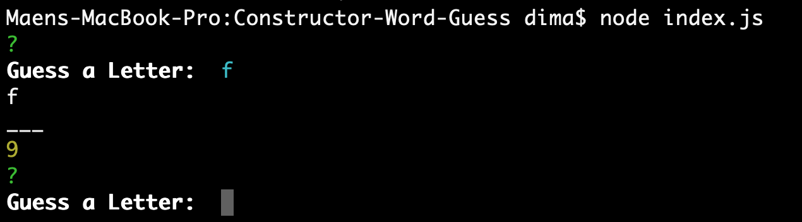

# Constructor-Word-Guess
Word-Guess is a command line game, that you can try to guess a word, you can enter a letter and the game is let you know if is the letter is correct or you have to guess anther letter.  
You have 10 time attempts, if you do not guess the word you will lose.
## How to install Constructor-Word-Guess:
* Clone this repository.
* Run npm install.
* statrt the Game.
* Enjoy!!.
## How to use Word-Guess:
Guess a Letter:  
start the game:  node index.js 
   
